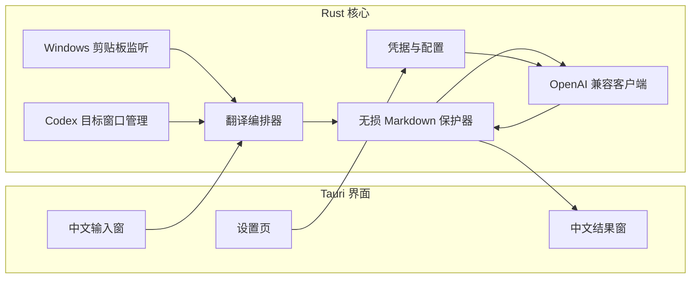
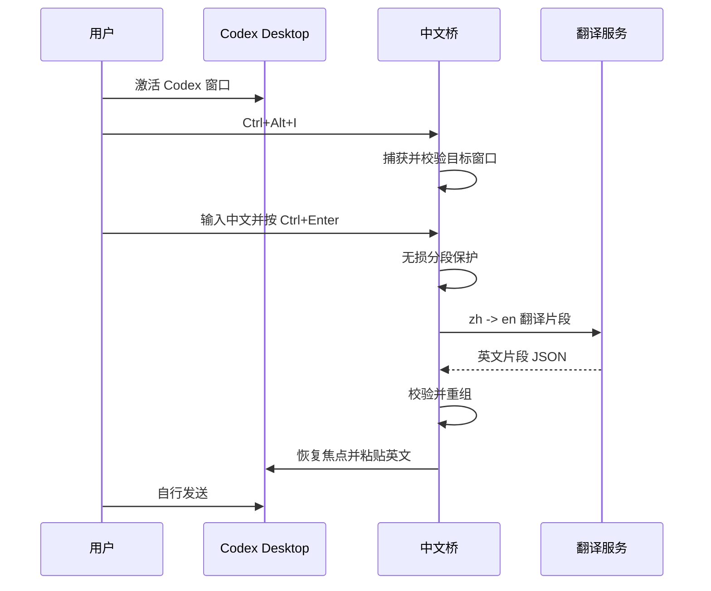
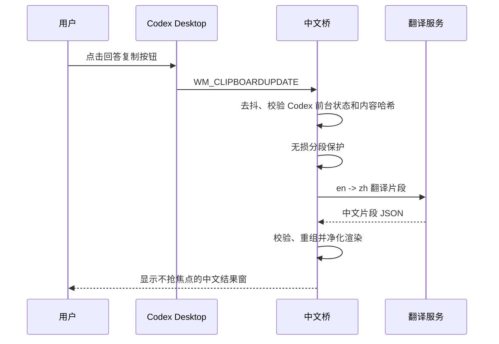

# Codex 中文桥 V1 设计文档

## 1. 设计目标

本设计实现一个 Windows 上运行的 Tauri 应用，为 Codex Desktop 提供独立的双向语言交互层。应用不访问 Codex 的内部数据、账号或会话接口，只使用用户可见的窗口焦点、系统剪贴板和模拟粘贴能力。

设计优先级如下：

1. 受保护技术内容的字节级保留。
2. 用户对焦点、粘贴和发送行为的控制。
3. 安全保存密钥，不持久化对话内容。
4. 轻量常驻和可恢复的 Windows 集成。
5. 正确渲染 Markdown 与数学公式。

## 2. 技术选型

| 层级 | 选择 | 原因 |
| --- | --- | --- |
| 桌面容器 | Tauri 2 | 使用 Windows WebView2，较 Electron 更轻，且能调用 Rust 原生能力。 |
| 原生逻辑 | Rust | 适合实现 Windows 窗口、剪贴板、焦点和输入事件。 |
| 界面 | Svelte 5 + TypeScript | 小体积，适合少量悬浮窗口和设置页。 |
| Markdown | unified / remark / rehype | 支持 GFM、数学公式与受控 HTML 净化。 |
| 数学公式 | remark-math + rehype-katex | 同时渲染行内和块级 LaTeX。 |
| HTTP | reqwest | 支持超时、取消和 OpenAI 兼容 JSON 请求。 |
| 密钥存储 | Windows Credential Manager（经 Rust keyring） | 不将 API Key 写入普通配置文件。 |
| Windows API | windows crate | 监听剪贴板、识别目标窗口和发送输入。 |

Tauri 是实现细节，不是用户需要掌握的运行时。发布物为 Windows 安装包或单个应用程序，依赖系统已有的 WebView2 运行时。

## 3. 总体架构



## 4. 运行时模块

### 4.1 `target_window`

职责：确认当前前台窗口是否为 Codex Desktop，保存输入流程需要回填的目标。

```rust
struct TargetWindow {
    hwnd: isize,
    pid: u32,
    executable_name: String,
    captured_at: Instant,
}
```

- 通过 `GetForegroundWindow`、`GetWindowThreadProcessId` 和进程映像名称识别窗口。
- 输入快捷键触发时创建 `TargetWindow` 快照。
- 粘贴前调用 `IsWindow` 并重新比对 PID、可执行程序特征，避免向已复用的窗口句柄输入。
- Codex 的程序特征从设置读取，提供默认探测值和手动校验功能。

### 4.2 `clipboard_watcher`

职责：在事件驱动而非轮询的条件下接收系统剪贴板变更。

- 在隐藏的原生消息窗口上调用 `SetClipboardFormatListener`。
- 收到 `WM_CLIPBOARDUPDATE` 后等待 250 ms 去抖，读取 `CF_UNICODETEXT`。
- 触发条件为：当前前台窗口是 Codex、内容可读取、长度超过阈值、哈希未重复，且不属于应用自身事务。
- 由于 Windows 剪贴板 API 不提供可靠来源进程，此机制不能精确区分 Codex 的复制按钮与 `Ctrl+C`；二者都按用户复制回答处理。

### 4.3 `translation_orchestrator`

职责：管理一次翻译的生命周期、取消、状态事件和结果投递。

- 每个窗口同一时刻最多有一个活动请求。
- 输入翻译使用 `zh -> en`，复制回答使用 `en -> zh`。
- API 调用开始、结束、失败和取消均通过 Tauri event 发送给前端。
- 调用前保存剪贴板快照和事务标识；调用成功才允许回填或渲染。
- 结果窗翻译失败时保留英文原文，不创建部分中文 DOM。

### 4.4 `format_guard`

职责：把 Markdown 拆分为不可变片段与可翻译自然语言片段，并在返回后无损重组。

它不依赖模型“记住格式”的能力。处理流程：

1. 对原始文本进行无损词法扫描，记录每个字符区间。
2. 将围栏代码、缩进代码、行内代码、数学公式、URL、链接目标、图片地址、HTML 标签、文件路径、命令、配置块和堆栈行标记为受保护区间。
3. 保留 Markdown 标记、表格分隔符和列表前缀作为静态区间；只有自然语言区间生成递增 ID，例如 `s_0001`。
4. 将 `[{ id, text }]` 批量发送给翻译服务，要求返回相同 ID 的 JSON 数组。
5. 验证返回 ID 集合、重复项、缺失项、长度限制和 JSON 结构。
6. 仅以翻译后的文本替换对应区间，其余原始字节直接复用。

这种方式允许标题、列表项、链接文本和表格单元格被翻译，但不会让模型改写 Markdown 结构或技术字面量。

对于无法安全解析的行，策略是扩大保护范围而不是猜测。例如含不完整代码围栏或疑似凭据的行，默认不提交翻译。

### 4.5 `provider_client`

职责：通过用户配置的 OpenAI 兼容接口执行单次翻译。

请求地址为规范化后的：

```text
{base_url}/v1/chat/completions
```

请求采用非流式 JSON。概念结构如下：

```json
{
  "model": "configured-model",
  "messages": [
    {
      "role": "system",
      "content": "You are a faithful technical translator. Return only the requested JSON translation segments. Do not optimize, add, remove, or explain."
    },
    {
      "role": "user",
      "content": "{\"source_language\":\"zh\",\"target_language\":\"en\",\"segments\":[{\"id\":\"s_0001\",\"text\":\"...\"}]}"
    }
  ],
  "temperature": 0
}
```

- 不依赖某些兼容服务可能不支持的 `response_format` 参数。
- 解析失败时，最多进行一次带有更严格 JSON 说明的重试；网络或鉴权错误不自动重试。
- 默认超时为 45 秒，可配置。
- 超过单请求预算的内容按顶层 Markdown 块安全切分，按顺序请求和重组。

### 4.6 `secure_storage`

职责：保存非敏感偏好并将密钥交给操作系统保管。

| 数据 | 存放位置 |
| --- | --- |
| API Base URL、模型、超时、快捷键、窗口偏好 | `%APPDATA%/CodexBridge/config.json` |
| API Key | Windows Credential Manager |
| 提示词、回答、翻译结果 | 仅内存，不持久化 |

配置变更与“测试连接”均不会在日志中输出 Authorization 头或 API Key。调试日志默认关闭，并且不得记录待翻译文本。

## 5. 窗口设计

### 5.1 中文输入窗

- 默认快捷键：`Ctrl+Alt+I`，可配置。
- 紧凑置顶窗口，包含多行输入区、状态区域、取消按钮和“翻译并粘贴”操作。
- `Ctrl+Enter` 提交，`Esc` 关闭并清空。
- 窗口仅在成功捕获 Codex 目标窗口后显示。
- 翻译成功时先隐藏输入窗，再恢复目标窗口焦点和执行粘贴。
- 如回填失败，重新显示输入窗及英文结果，允许用户手动复制。

### 5.2 中文结果窗

- 剪贴板触发时在屏幕右下角显示，置顶但初始不抢焦点。
- 首屏展示加载状态，完成后替换为渲染后的中文 Markdown。
- 工具栏仅包含查看原文、复制中文、固定和关闭。
- 使用受净化的 HTML 渲染 Markdown；代码块支持横向滚动和复制，公式使用 KaTeX 渲染。
- 关闭结果窗即释放文本与渲染状态；不写入历史记录。

### 5.3 设置页

- API Base URL、Model、API Key 输入与连接测试。
- Codex 目标程序状态与重新识别。
- 输入快捷键与显示偏好。
- 剪贴板恢复和疑似敏感内容确认开关。

## 6. 核心流程

### 6.1 输入回填流程



粘贴通过 `SetForegroundWindow`、必要时的线程输入附加，以及 `SendInput` 模拟 `Ctrl+V` 完成。应用不得模拟 Enter。粘贴后仅在剪贴板序列号未变化时恢复用户此前的剪贴板内容。

### 6.2 回答翻译流程



## 7. 剪贴板事务与循环保护

```rust
struct ClipboardTransaction {
    content_hash: String,
    expected_sequence: u32,
    created_at: Instant,
    restore_snapshot: Option<String>,
}
```

输入回填时，应用记录英文本体哈希和系统剪贴板序列号。监听到相同内容或事务窗口内的变更时，直接忽略。恢复旧剪贴板前再次检查序列号，若用户或其他应用已经复制了新内容，则绝不覆盖。

该策略用于防止自动翻译流程循环，同时避免破坏用户正常的剪贴板使用。

## 8. 安全与隐私

- 所有原始文本只在内存中存在，直至窗口关闭或请求结束。
- 受保护区间不发送到翻译 API；用户需要知道，其他自然语言文本仍会发送到其配置的服务商。
- 通过正则和上下文检测疑似私钥、Token、连接串和 `.env` 内容；命中时要求显式确认。
- Markdown 渲染链关闭原始 HTML，最终输出再经 HTML 净化后才插入 DOM。
- 网络层强制 HTTPS，除非用户在设置中明确确认本地或企业 HTTP 服务。
- 任何错误文本必须脱敏 Authorization 头、API Key 和待翻译内容。

## 9. 项目结构

```text
src-tauri/
  src/
    main.rs
    app_state.rs
    commands.rs
    target_window.rs
    clipboard_watcher.rs
    clipboard_transaction.rs
    translation/
      mod.rs
      orchestrator.rs
      provider_client.rs
      format_guard.rs
      sensitive_content.rs
    storage/
      config.rs
      secrets.rs
  tests/
    format_guard_fixtures.rs
    provider_contract.rs

src/
  lib/
    tauri.ts
    markdown.ts
  routes/
    prompt-window/
    reader-window/
    settings/
  components/
    MarkdownRenderer.svelte
    PromptComposer.svelte
    ReaderToolbar.svelte
```

## 10. 测试策略

| 层级 | 重点 |
| --- | --- |
| Rust 单元测试 | Markdown 分段、受保护区间、编号校验、剪贴板事务、敏感内容检测。 |
| 契约测试 | 使用本地模拟服务验证 OpenAI 兼容请求、超时、错误和非标准 JSON 响应。 |
| 前端组件测试 | 加载、失败、原文切换、代码复制、Markdown 与公式渲染。 |
| Windows 手工集成测试 | Codex 前台识别、快捷键、焦点恢复、复制按钮触发、DPI、剪贴板恢复。 |
| 回归样本 | 中英文混排、嵌套列表、GFM 表格、代码围栏、LaTeX、链接、堆栈和配置文件。 |

最关键的回归断言是：所有受保护区间在输入和输出中的字节序列完全相同。

## 11. 交付顺序

1. 初始化 Tauri 工程、设置页和安全配置存储。
2. 实现 Codex 目标窗口识别、输入悬浮窗和安全回填。
3. 实现 OpenAI 兼容客户端与错误状态。
4. 实现无损 Markdown 保护器及其测试夹具。
5. 实现剪贴板事件监听、去抖和循环保护。
6. 实现 Markdown、代码与公式渲染的结果窗。
7. 完成 Windows 集成测试、安装包和用户说明。
